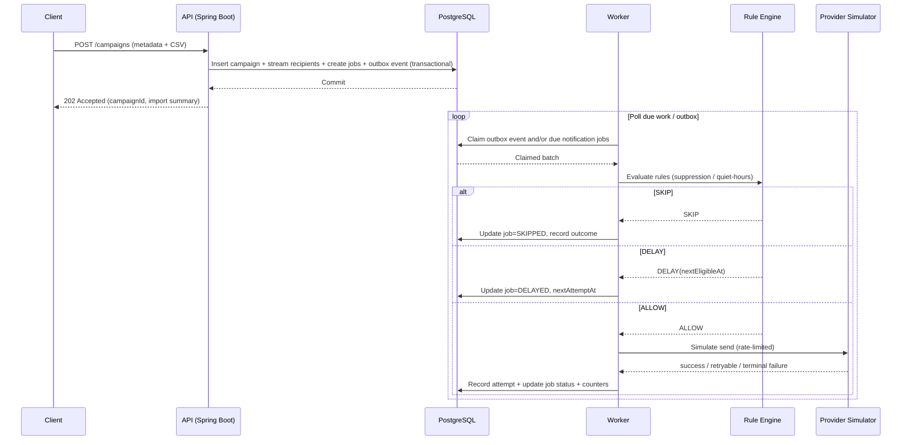

# Architecture Diagram

## Overview

The platform is implemented as a modular monolith (Spring Boot) with internal bounded contexts, PostgreSQL-backed workflow state, a transactional outbox, and DB-backed workers. The design is intentionally extensible to broker-based processing later.

## High-Level Runtime Architecture (Mermaid)

```mermaid
flowchart LR
    Client[API Client / Tenant Caller] -->|POST /campaigns, GETs, retry-failures| API[Spring Boot API Layer]

    subgraph App[Notification Platform Backend (Modular Monolith)]
        API --> CM[Campaign Management Context]
        API --> AI[Audience Ingestion Context<br/>Streaming CSV Parser]
        API --> TG[Tenant Governance Context]

        CM --> DO[Delivery Orchestration Context]
        DO --> RE[Rule Engine Context]
        DO --> RL[Channel Throttling / Rate Limit Component]
        DO --> OUTP[Outbox Poller / Dispatcher]
        DO --> W[Worker Loop(s)]

        W --> RE
        W --> RL
        W --> PS[Provider Simulator Adapters<br/>(Email/SMS/Push)]

        CM --> OBS[Structured Logging + Metrics]
        AI --> OBS
        DO --> OBS
        W --> OBS
        RE --> OBS
        RL --> OBS
    end

    subgraph DB[PostgreSQL]
        T[(tenants / tenant policy)]
        S[(global suppression list)]
        C[(campaigns)]
        CR[(campaign_recipients)]
        NJ[(notification_jobs)]
        NA[(notification_attempts)]
        O[(outbox_events)]
        PL[(worker_partition_leases - Part 4)]
    end

    TG <--> T
    TG <--> S
    CM <--> C
    AI <--> CR
    DO <--> NJ
    W <--> NA
    OUTP <--> O
    W <--> NJ
    W <--> PL

    PS -->|success / retryable / terminal result| W
    OBS --> LOGS[(JSON Logs / Console)]
    OBS --> METRICS[(Actuator / Micrometer Metrics)]
```

## End-to-End Control Flow (Mermaid Sequence)



## Diagram Notes

- `outbox_events` is kept even in the single-service design to preserve transactional consistency and future broker migration options.
- `worker_partition_leases` is included in the diagram as a Phase 4 component to ensure schema and architecture are forward-compatible.
- Observability is shown as a first-class path because the assessment requires structured logging and operational reasoning.
